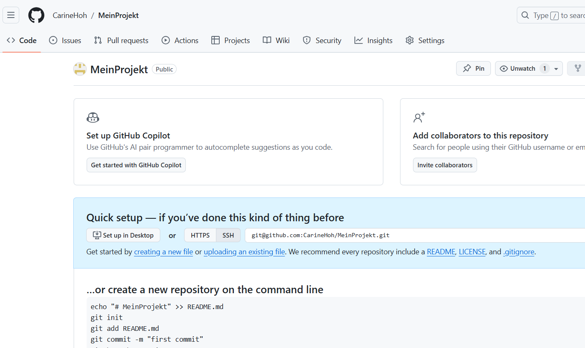

# MeinProjekt - GitHub Repository Setup und Workflow


## 1. GitHub Repository Setup

- **Schritte:**
  1. Zu GitHub (www.github.com) gehen und sich anmelden.
  2. Auf "+ New" klicken und ein neues Repository mit dem Namen "MeinProjekt" erstellen.
  3. Die URL des Repositories notieren.

- **Screenshot: erstellte GitHub Repository**
  

---

## 2. SSH-Schlüssel erstellen

- **Schritte:**
  1. Terminal (oder Git Bash) öffnen und überprüfen, ob ein SSH-Schlüssel vorhanden ist:
     ```bash
     ls ~/.ssh/
     ```
  2. Wenn kein Schlüssel vorhanden ist, einen neuen SSH-Schlüssel erstellen:
     ```bash
     ssh-keygen -t rsa -b 4096 -C "deine_email@beispiel.com"
     ```
  3. SSH-Schlüssel zu GitHub hinzuFüge (unter Settings > SSH and GPG keys).

- **Screenshot: SSH Schlüssel erstellen**
  

- **Screenshot: SSH Schlüssel in Github**

  


---

## 3. Lokales Repository klonen und Git konfigurieren

- **Schritte:**
  1. GitHub-Repository klonen:
     ```bash
     git clone git@github.com:DeinCarineHoh/MeinProjekt.git
     ```
  2. In das geklonte Verzeichnis wechslen:
     ```bash
     cd MeinProjekt
     ```
  3. Git mit meinem Namen und meiner E-Mail Konfigurieren:
     ```bash
     git config user.name "Carine Hoh"
     git config user.email "cmsocial2@gmail.com"
     ```

- **Screenshot: Repository klonen und konfigurieren**
  

---

## 4. Initialen Commit erstellen

- **Schritte:**
  1. Datei `main.py`erstellen und Folgendes hinzufügen:
     ```bash
     echo "# MeinProjekt Hauptdatei" > main.py
     git add main.py
     git commit -m "Initialer Commit"
     ```

- **Screenshot: Initial Commit**
  


---

## 5. Feature-Branch erstellen

- **Schritte:**
  1. neuen Branch namens "feature" erstellen und dazu wechseln:
     ```bash
     git checkout -b feature
     ```
  2. Datei `utils/database.py` hinzufügen:
     ```bash
     mkdir utils
     echo "# Datenbankfunktionen" > utils/database.py
     git add utils/database.py
     git commit -m "Neue Funktion hinzugefügt"
     ```

- **Screenshot: Feature-Branch erstellen**
  


---

## 6. Bearbeitung im Feature-Branch

- **Schritte:**
  1. `main.py` bearbeiten und einen Commit durchführen:
     ```bash
     echo "print('Hello from feature branch')" >> main.py
     git add main.py
     git commit -m "Hauptdatei aktualisiert"
     ```

- **Screenshot: Bearbeitung im Feature-Branch**
  


---

## 7. Merge von Feature-Branch in Master-Branch

- **Schritte:**
  1. Zurück zum Main-Branch wechseln:
     ```bash
     git checkout main
     ```
  2. `main.py` bearbeiten und die Änderungen committen:
     ```bash
     echo "print('Hello from master branch')" >> main.py
     git add main.py
     git commit -m "Hauptdatei aktualisiert"
     ```
  3. Feature-Branch in den Main-Branch mergen:
     ```bash
     git merge feature
     ```
  4. Merge-Konflikt manuell in `main.py` lösen.

- **Screenshot: Merge-Konflikt lösen**
  


---

## 8. Abgabe

1. Lokale Repository an GitHub-Konto pushen:
   ```bash
   git push -u origin main


